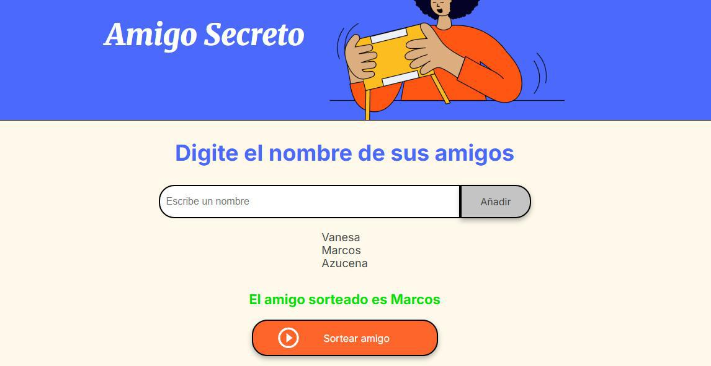

<h1 align="center"> CHALLENGE AMIGO SECRETO </h1>

<h2> Descripción del Proyecto </h2>

Este proyecto está diseñado para que permitir a los usuarios ingresar varios nombres y luego seleccionar aleatoriamente alguno de ellos. Por lo que es muy funcional para sorteo de amigos para realizar alguna actividad en conjunto o seleccionar a alguien para realizar una tarea específica 

<h3> Estado del Proyecto </h3>

🚧 Proyecto en construcción 🚧

<h4>Funcionalidades del Proyecto </h4>
<ul>
  <li>Funcionalidad 1: Almacenar nombres ingresados </li> 
  <li>Funcionalidad 2: Sortear un nombre de los nombres almecanados</li>
</ul>
<h5> Autora </h5>
  
Martha Morales
 

